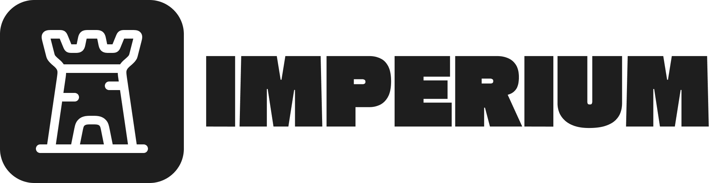
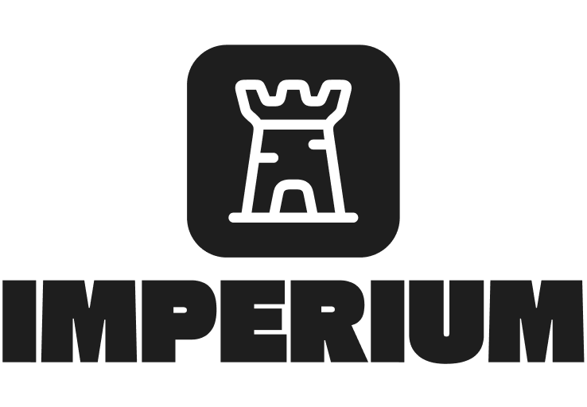
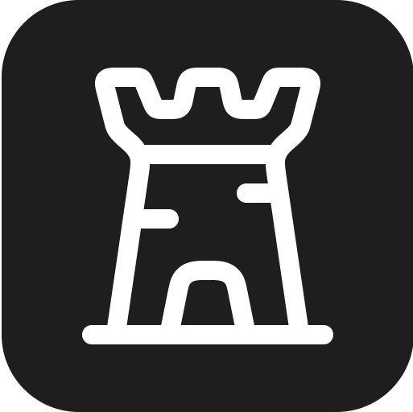

# Imperium

  

Imperium is a web-based local network game streaming platform. It lets you register local hosts, discover them on your LAN, and stream from a selected host to a client via WebRTC.

---

## Monorepo structure

- `apps/auth-server`: Spring Boot service for authentication, host registry/status, and matchmaking.
- `apps/client`: Go-powered local client with a React-based web UI.
- `apps/host`: Go desktop app (Fyne) that registers a host, manages status, and streams via WebRTC.
- `assets`: Brand assets and logos.

---

## Tech highlights

- **Auth Server**: Java, Spring Boot, JPA (PostgreSQL), Flyway, JWT, Docker Compose.
- **Client**: Go (Gin), React, WebRTC, WebSockets.
- **Host**: Go (Fyne UI), WebRTC, FFmpeg wrapper, monitor detection.

---

## Quick start

> These are development-oriented notes; production setup may differ.

### Auth Server (`apps/auth-server`)

- With Docker:
  - From `apps/auth-server`: `docker compose up -d`
- With Gradle (requires JDK 21+):
  - From `apps/auth-server`: `./gradlew bootRun` (or `gradlew.bat bootRun` on Windows)
- Configuration:
  - See `src/main/resources/application.properties` and `application-prod.properties`
  - DB migrations: `src/main/resources/db/migrations`

### Client (`apps/client`)

- Go backend (requires Go 1.21+):
  - From `apps/client`: `go run ./cmd/main.go`
- Web UI (Vite + React):
  - From `apps/client/webui`: `pnpm install && pnpm dev`
  - Build: `pnpm build` (artifacts go to `apps/client/internal/webui/assets/`)

### Host (`apps/host`)

- Run (requires Go 1.21+ and FFmpeg in PATH for recording/streaming):
  - From `apps/host`: `go run ./cmd/main.go`
- UI config:
  - `apps/host/cmd/FyneApp.toml`
- Binary:
  - `apps/host/imperium-host.exe` (may be present for quick local testing)

---

## Assets

  

  

  

> All assets are available in `assets/`.

---

## Status

This project is under active development; APIs and flows may change.
